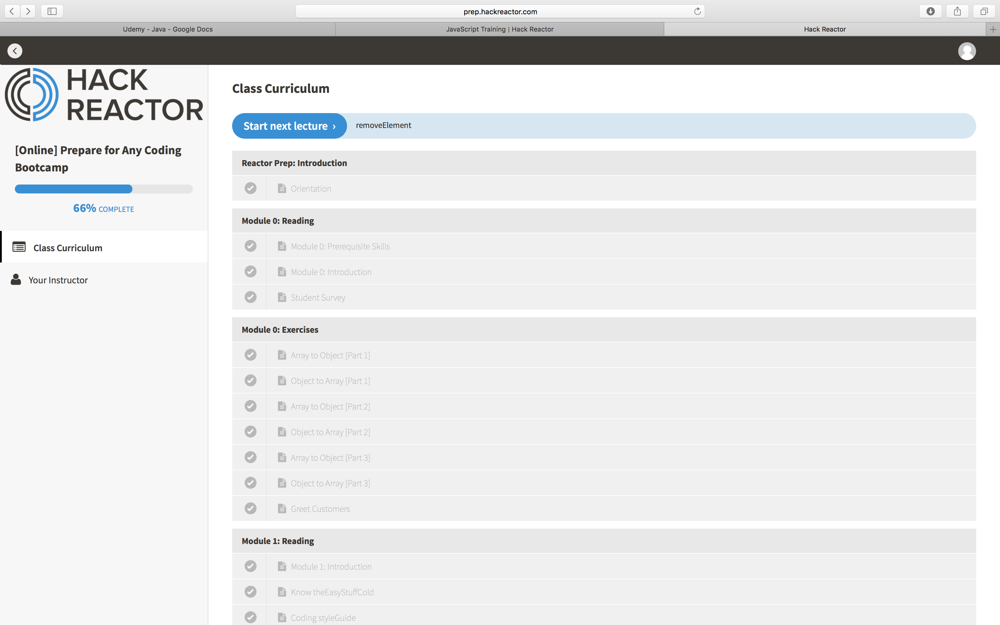
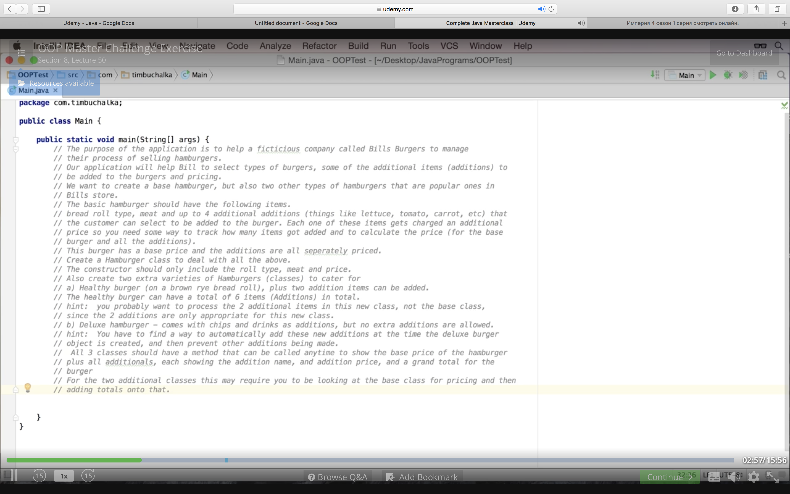

# Angular Extended
#### Angular Extended describes all the goals set up for Friday independent project and whether/how they were achieved. Published on 09/29/2017.
#### By **Katsiaryna Mashokha**
## Here are the goals I set up in the morning to achieve:

I. JavaScript  
1) Do some Hack Reactor problems  
2) Recursion  
3) What is factory functions? (inheritance in JS)  

II. Java    
4) Anonymous inner classes - what is it?    
5) Watch some lectures on Udemy Complete Java Masterclass and do at least one challenge    

III. Android    
6) Create a plan for how and what to study during my Android semester    

And here is the description what actually was done:

1) I've done some HackReactor problems. Here is the starting state:

And here is where I ended:
  

2) While working on those problems, some of them required recursion to use. After spending some time on reading about it and trying to understand, it all made sense. Here is one of the helpful examples about recursion:

Also there were a few Hack Reactor problems that could be solves using recursion. For example, this one:
  

3) After trying to figure out what are the factory functions are, it did not really got clear to me. Probably one of the things I understood about them was that they are functions that create object and return them. In most cases you can use factories instead of classes. Functions that return an object are called factory functions.    

4) To understand something about anonymous inner classes was very hard as well. Generally, anonymous classes are the classes that have no name. They declare and instantiate a class at the same time. Looks like they are often used in Android for instantiating, for example, click listeners:
button.setOnClickListener(new View.OnClickListener() {...});  

5) Then I watched some Java videos on polymorphism and did a challenge. Here is the challenge:  . And here you can see my solution:
  

6) So thinking about studying process for Android semester I came up with the following plan. I will try to follow it as closely as possible (this plan is for after Epicodus evening time):
  * Watch Java videos and solve the provided problems along with it (~ 1hr.)
  * Read the book on Android Development ( ~ 1hr.)
  * Spend some time on my personal Android project ( ~ 1 hr.)
  * On the weekends make sure that I devote time to learning algorithms.  

7) Also I found a online event which is called "Tackle Problems as a Professional Programmer". I registered for it and will watch it on Sunday.
  

### License
Copyright (c) 2017 **_Katsiaryna Mashokha_**
